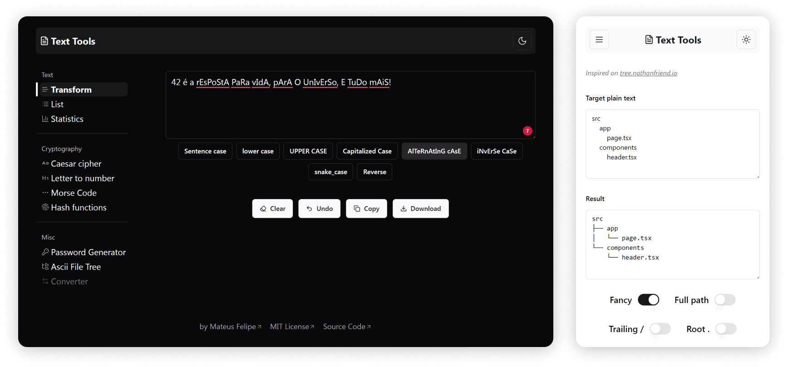

<div align="center">
  
<h1>  </h1>

A collection of text transform tools, like change string case, get text statistics, generate hashes, and more!



</div>

# Features

- [**Text case transform**](https://text.mateusf.com/text/transform)
- [**List manupulation**](https://text.mateusf.com/text/list)
- [**Text statistics**](https://text.mateusf.com/text/statistics)
- [**Caeasar cipher**](https://text.mateusf.com/cryptography/caesar)
- [**Letter-to-number**](https://text.mateusf.com/cryptography/letter-number)
- [**Morse code**](https://text.mateusf.com/cryptography/morse)
- [**Hash generator**](https://text.mateusf.com/cryptography/hash)
- [**Base64**](https://text.mateusf.com/cryptography/base64)
- [**Password generator**](https://text.mateusf.com/misc/password)
- [**ASCII File Tree**](https://text.mateusf.com/misc/tree)
- _Converters_ https://github.com/mateusfg7/text-tools/issues/30
- _URL Encode/Decode_ https://github.com/mateusfg7/text-tools/issues/29
- _Hacker Key_ https://github.com/mateusfg7/text-tools/issues/21
- _Geek Code_ https://github.com/mateusfg7/text-tools/issues/20
- _Rail Fence Cipher_ https://github.com/mateusfg7/text-tools/issues/14

# Development & Contributing

This project is built with [Next.js](https://nextjs.org/), a [React](https://react.dev/) framework and [Bun](https://bun.sh/) runtime. For styling, it uses [TailwindCSS](https://tailwindcss.com/) and [shadcn/ui](https://ui.shadcn.com/).

For code styles, it uses [ESLint](https://eslint.org/) and [Prettier](https://prettier.io/). Also keep the conventional commits pattern for commit messages.

The tests are written with Bun Test.

**Installation**

```bash
bun install
```

**Start dev server**

```bash
bun dev
```

---

**refs**:

- _https://convertcase.net/_
- _browserling.com/tools/all-hashes_
